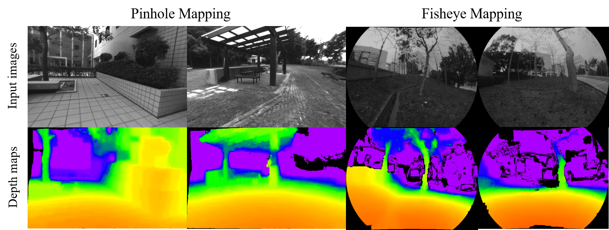

# Pinhole-Fisheye-Mapping: Fisheye Branch
## A monocular dense mapping system for pinhole and fisheye cameras

This is a monocular dense mapping system following the IROS 2018 submission **Adaptive Baseline Monocular Dense Mapping with Inter-frame Depth Propagation**, Kaixuan Wang, Shaojie Shen. The implementation will be open source after the acceptance of the paper.

Benefiting from the proposed adaptive baseline matching cost computation, belief propagation based depth extraction and depth refinement using inter-frame propagated depth filter, our system can generate high-quality depth maps in real-time using a pinhole or a fisheye camera.

An example of the system output is shown:



A video can be used to illustrate the pipeline and the performance of our system:

<a href="https://youtu.be/sjxMjsl-fD4" target="_blank"></a>

## 0.0 Disclaimer

Here, we provide an open source version of the fisheye depth map estimation. Due to the complexity of the system, we cannot provide all supports if you want to use it in your projects.

## 1.0 Prerequisites
+ **OpenCV**
+ **Eigen**
+ **CUDA**

Here we use CUDA 8.0. CUDA 9.0 has not been tested.

## 2.0 Download the rosbag

We provide an example rosbag for you to test the project via [the link](https://www.dropbox.com/s/nv4sz71dbe3d64c/fisheye_short.bag?dl=0).

## 3.0 Run the code

### 3.1 Download the code 

Move the rospackage ```camera_model``` and ```fisheye_mapping``` into the ```catkin_ws/src```. **Please Note** the ```camera_model``` is the package from [gaowenliang](https://github.com/gaowenliang). The namespace in the ```camera_model``` is not consistent with that of the ```camera_model``` used in VINS-Mono. You may want to disable the VINS-Mono if it exists in your ```catkin_ws```. Please contact and push [gaowenliang](https://github.com/gaowenliang) if you want them to be consist :).

### 3.2 Compile

Change the line 28 and line 29 in the ```CMakeLists.txt``` accoding to the GPU you use.

Change the line 7 in the ```launch/fisheye.launch``` accoding to your own environment to ```config/polyfisheye.yaml```.

Just ```catkin_make``` in the ```catkin_ws```.

### 3.3 Run!

Just

```roslaunch fisheye_mapping fisheye.launch``` and play the rosbag you downloaded.

 The depth map is published in ```/fisheye_mapping/colored_depthmap```.
 
## 4.0 Acknowledgement

As you may find out, we uses many codes from [REMODE](https://github.com/uzh-rpg/rpg_open_remode) to develop the project. Thanks a lot!

